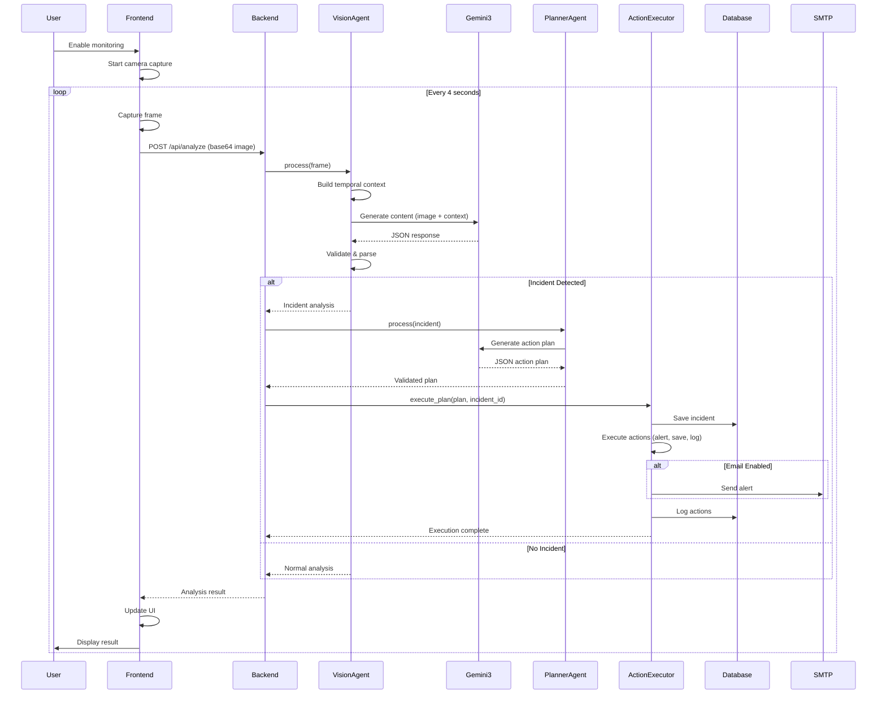
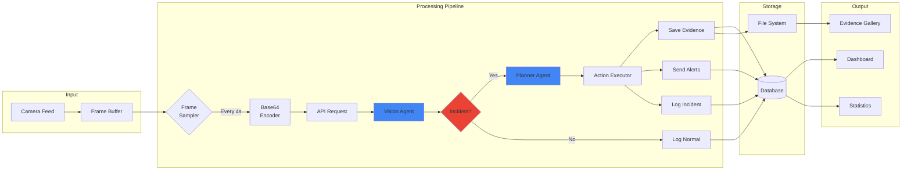
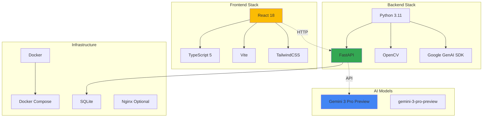
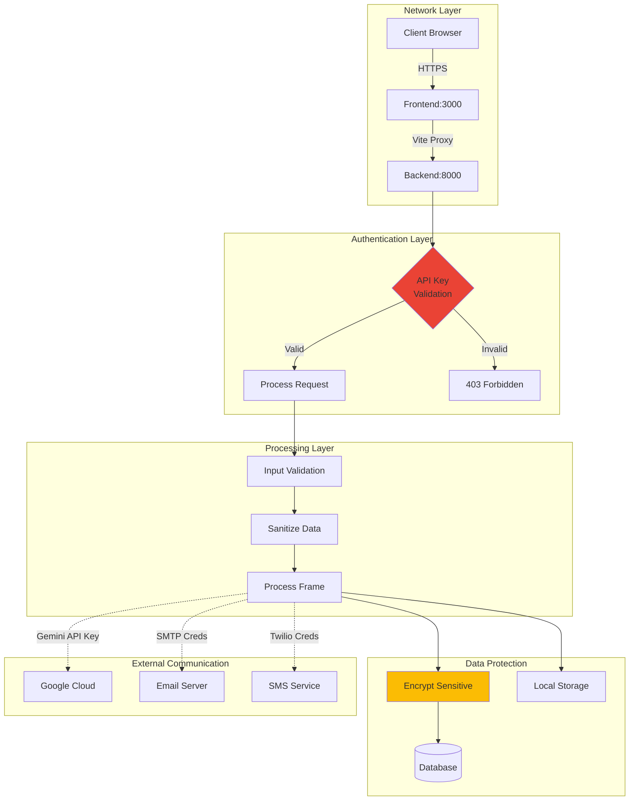
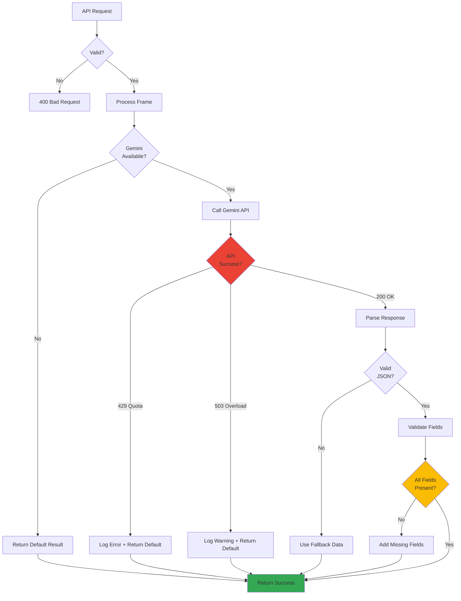
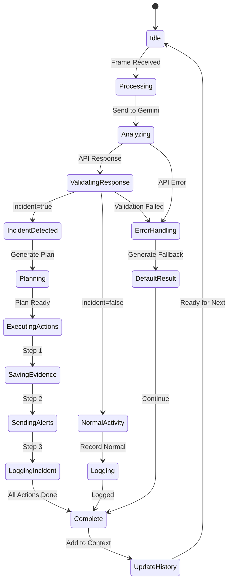

# 🏗️ NEUROAEGIS CORTEX - SYSTEM ARCHITECTURE

## High-Level Architecture

```mermaid
graph TB
    subgraph "Frontend Layer"
        A[React TypeScript UI] --> B[Video Feed Component]
        A --> C[Analysis Dashboard]
        A --> D[Action Panel]
        A --> E[Evidence Gallery]
    end
    
    subgraph "API Layer"
        F[FastAPI Backend] --> G[/api/analyze]
        F --> H[/api/health]
        F --> I[/api/evidence]
        F --> J[/api/stats]
    end
    
    subgraph "AI Processing Layer"
        K[Vision Agent<br/>Gemini 3 Pro] --> L[Frame Analysis]
        M[Planner Agent<br/>Gemini 3 Pro] --> N[Response Planning]
    end
    
    subgraph "Execution Layer"
        O[Action Executor] --> P[Email Alerts]
        O --> Q[SMS Alerts]
        O --> R[IoT Actions]
        O --> S[Evidence Storage]
    end
    
    subgraph "Data Layer"
        T[(SQLite Database)] --> U[Incidents]
        T --> V[Actions]
        T --> W[System Stats]
        X[File System] --> Y[Evidence Images]
    end
    
    subgraph "External Services"
        Z[Google Gemini API]
        AA[SMTP Server]
        AB[Twilio SMS]
    end
    
    B -->|Base64 Image| G
    G -->|Frame Data| K
    K -->|Analysis Result| M
    M -->|Action Plan| O
    O --> T
    O --> X
    
    K -.->|API Calls| Z
    M -.->|API Calls| Z
    O -.->|Email| AA
    O -.->|SMS| AB
    
    C -->|Fetch Stats| J
    E -->|Load Images| I
    
    style K fill:#4285f4
    style M fill:#4285f4
    style Z fill:#ea4335
```

## Detailed Component Flow



## Data Flow Architecture



## Technology Stack



## Deployment Architecture

```mermaid
graph TB
    subgraph "Docker Environment"
        subgraph "Frontend Container"
            A[Nginx] --> B[React Build]
            B --> C[Port 3000]
        end
        
        subgraph "Backend Container"
            D[Uvicorn] --> E[FastAPI App]
            E --> F[Port 8000]
            E --> G[Vision Agent]
            E --> H[Planner Agent]
            E --> I[Action Executor]
        end
        
        subgraph "Storage"
            J[(SQLite DB)]
            K[Evidence Directory]
        end
    end
    
    subgraph "Host Machine"
        L[Camera Device] --> M[/dev/video0]
    end
    
    subgraph "External"
        N[Gemini API]
        O[SMTP Server]
        P[Twilio API]
    end
    
    C -->|Vite Proxy| F
    M -.->|Optional| D
    
    G -.->|HTTPS| N
    H -.->|HTTPS| N
    I -.->|SMTP| O
    I -.->|HTTPS| P
    
    E --> J
    E --> K
    
    style N fill:#4285f4
    style A fill:#34a853
    style D fill:#34a853
```

## Security Architecture



## Error Handling Flow



## Agent State Machine



---

## System Specifications

### Performance Characteristics

| Metric | Value |
|--------|-------|
| Average Processing Time | 4.9s per frame |
| Throughput | ~12 frames/minute |
| Latency (end-to-end) | <6s |
| Database Query Time | <10ms |
| Evidence Save Time | <100ms |

### Resource Requirements

| Resource | Minimum | Recommended |
|----------|---------|-------------|
| CPU | 2 cores | 4+ cores |
| RAM | 4GB | 8GB |
| Disk | 10GB | 50GB+ |
| Network | 10 Mbps | 50+ Mbps |

### Scalability

- **Single Camera:** 12 frames/min
- **Multiple Cameras:** Deploy multiple backend instances
- **Horizontal Scaling:** Add containers as needed
- **Load Balancing:** Nginx for distribution

---

## Key Design Decisions

### 1. Why Microservices Architecture?
- **Modularity:** Easy to upgrade individual components
- **Scalability:** Can scale agents independently
- **Maintainability:** Clear separation of concerns

### 2. Why Docker?
- **Portability:** Works on any platform
- **Isolation:** Dependencies contained
- **Reproducibility:** Same environment everywhere

### 3. Why SQLite?
- **Simplicity:** No separate database server
- **Performance:** Fast for single-node deployments
- **Portability:** Database is a single file

### 4. Why Two AI Agents?
- **Specialization:** Each optimized for its task
- **Flexibility:** Can use different models/versions
- **Clarity:** Separate vision from planning logic

---

**This architecture provides a solid foundation for intelligent, scalable security monitoring powered by Gemini 3.**
